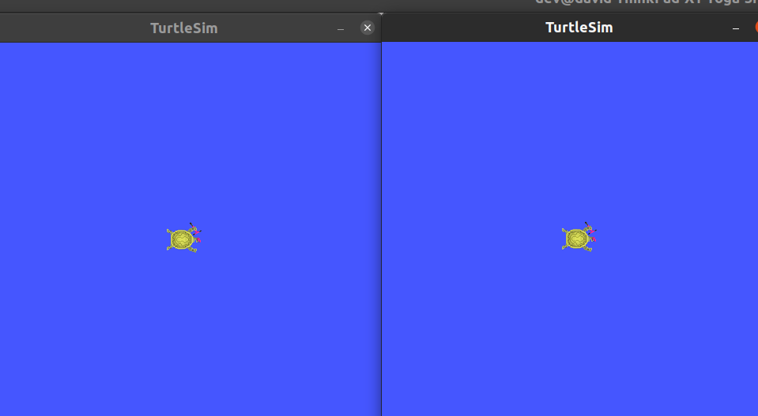

# ROS2 Sim-Real Robot Control Workspace

Este workspace contiene la configuración para la simulación y control de robots utilizando ROS2 Humble con MoveIt!2, nav2, aerostack2, Slamtoolbox y Gazebo.


## Requisitos Previos

- Docker instalado y configurado
- Docker Compose instalado
- Mínimo 40GB de espacio en disco
- GPU opcional (pero recomendada para Gazebo)

## 1. Importar y compilar la imagen del Docker

### Importar el directorio de github

```bash
git clone https://github.com/davidredondo0/ROS2_COURSE.git
```

Si no tienes git, ve al repositorio del curso en [github](https://github.com/davidredondo0/ROS2_COURSE), descargalo y extrae el  directorio.

### Construir la imagen Docker

Ejecuta el siguiente comando por terminal para compilar la imagen Docker:

```bash
docker-compose build
```
### NOTA: Si estas ejecutando el docker en windows, puedes abrir una terminal de powershell e ir al directorio donde has extraido lo que has descargado de github.

Esto creará la imagen basada en `ubuntu:22.04` con ROS2 Humble preinstalado.

**Tiempo estimado:** 30-60 minutos (depende de tu conexión y velocidad de tu PC)

### NOTA: Si estás ejecutando este proyecto en **Windows** usando Docker Desktop, es necesario realizar una configuración adicional para ver las interfaces gráficas (GUI) de ROS 2.

### 1. El Problema
Docker en Windows se ejecuta sobre un subsistema Linux (WSL 2) que no tiene pantalla física. Por defecto, las aplicaciones gráficas intentarán abrirse y fallarán con errores como:
> `qt.qpa.xcb: could not connect to display`

Para solucionar esto, necesitamos instalar un **Servidor X** en Windows que reciba y muestre las ventanas que genera el contenedor.

### 2. Instalación de VcXsrv
1. Descarga e instala **VcXsrv Windows X Server** desde [SourceForge](https://sourceforge.net/projects/vcxsrv/).
2. Una vez instalado, ejecuta el programa **XLaunch**.

### 3. Configuración de XLaunch
Cada vez que inicies XLaunch, debes configurarlo de la siguiente manera para permitir la conexión desde Docker:

1.  **Display settings:** Selecciona "Multiple windows" → Siguiente.
2.  **Client startup:** Selecciona "Start no client" → Siguiente.
3.  **Native opengl**: **DESMARCAR**
4.  **Disable access control**: **MARCAR**
5.  Finalizar configuración.


### 4. Configuración del Docker Compose
Asegúrate de que tu archivo `docker-compose.yaml` utiliza la dirección especial de red para conectar con el host de Windows.

**En el `docker-compose.yaml`:**

```yaml
environment:
  # Apunta al host de Windows (WSL 2)
  - DISPLAY=host.docker.internal:0.0
  # Soluciona problemas de renderizado en QT
  - QT_X11_NO_MITSHM=1
```

## 2. Inicializar el Contenedor

### Opción A: Usando docker-compose (Recomendado)

```bash
docker-compose up -d
```

Esto inicia el contenedor en modo detached. Para entrar al contenedor:

```bash
docker-compose exec ros2 bash
```

### Opción B: Usando Docker directamente

```bash
docker run -it --name ros2 --gpus all \
  -v ~/ros2_ws:/home/ros2_ws \
  -e DISPLAY=$DISPLAY \
  -v /tmp/.X11-unix:/tmp/.X11-unix \
  ros2:latest bash
```

### Para finalizar la ejecución del docker, realiza el siguiente comando

```bash
docker-compose down
```

## 3. Verificar que el Docker Funciona Correctamente

Una vez dentro del contenedor, ejecuta los siguientes comandos para verificar:

### Verificar instalación de ROS2 Humble

```bash
docker-compose down
docker-compose up -d
docker-compose esec ros2 bash
source /opt/ros/humble/setup.bash
ros2 launch turtlesim multisim.launch.py
```

Deberías ver algo asi:



Si no hay errores, ROS2 está funcionando correctamente.

### Verificar que funciona gazebo

Gazebo es el simulador que usaremos, para ejecutarlo escribe el siguiente comando por la terminal del docker.

```bash
gazebo
```

## 4. Compilar el Workspace

```bash
colcon build --symlink-install --cmake-args -DCMAKE_BUILD_TYPE=Release
```

**Explicación de las flags:**
- `--symlink-install`: Crea symlinks en lugar de copiar archivos, lo que acelera las recompilaciones
- `--cmake-args -DCMAKE_BUILD_TYPE=Release`: Compila en modo Release para mejor rendimiento

**Tiempo estimado:** 30-60 minutos (primera compilación)

### Sourcing del entorno compilado

Una vez completada la compilación:

```bash
source /home/ros2_ws/install/setup.bash
```

Para hacerlo automático en futuras sesiones, añade a `~/.bashrc`:

```bash
echo "source /home/ros2_ws/install/setup.bash" >> ~/.bashrc
```

## 5. Verificar la Compilación

### Verificar que los paquetes están instalados

```bash
ros2 pkg list | grep ros2srrc
```

Deberías ver paquetes como:
- `ros2srrc_execution`
- `ros2srrc_launch`
- `ros2srrc_moveit`
- `ros2srrc_robots`
- etc.

## 6. Troubleshooting

### Error: "ros2: command not found"

Solución:
```bash
source /opt/ros/humble/setup.bash
```

### Error: "No packages found in the workspace"

Solución: Asegúrate de que estás en el directorio correcto:
```bash
cd /home/ros2_ws
colcon build --symlink-install --cmake-args -DCMAKE_BUILD_TYPE=Release
```

### Error: "GPU not found" (si usas GPU)

Solución: Asegúrate de que Docker tiene acceso a GPU:
```bash
docker run --gpus all ...
```

## 7. Comandos Útiles

### Limpiar y recompilar desde cero

```bash
cd /home/ros2_ws
rm -rf build install log
colcon build --symlink-install --cmake-args -DCMAKE_BUILD_TYPE=Release
```

### Ver estado del contenedor Docker

```bash
docker-compose ps
```

### Detener el contenedor

```bash
docker-compose down
```


### Entrar al contenedor en ejecución

```bash
docker-compose exec ros2_ws bash
```

## 8. Estructura del Workspace

```
ros2_ws/
├── src/                          # Código fuente
│   ├── ros2_SimRealRobotControl/
│   │   ├── ros2srrc_execution/   # Scripts de ejecución
│   │   ├── ros2srrc_launch/      # Archivos de lanzamiento
│   │   ├── ros2srrc_moveit/      # Configuración de MoveIt!2
│   │   ├── ros2srrc_robots/      # Descripciones de robots
│   │   └── ...
│   └── ...
├── Dockerfile                    # Configuración Docker
├── docker-compose.yaml           # Composición Docker
└── README.md                     
```

## 9. Referencias y Documentación

- [ROS2 Humble Documentation](https://docs.ros.org/en/humble/)
- [MoveIt!2 Documentation](https://moveit.ros.org/)
- [Gazebo Documentation](https://gazebosim.org/)
- [IFRA-Cranfield GitHub](https://github.com/IFRA-Cranfield/)
- [Aerostack2 Github](https://github.com/aerostack2)
- [Inverted Pendulum](https://github.com/ros2-realtime-demo/pendulum)
- [Turtlebot](https://github.com/ROBOTIS-GIT/turtlebot3)

---

**Última actualización:** Febrero 2026
**Versión:** ROS2 Humble
**Autor:** David Redondo 

